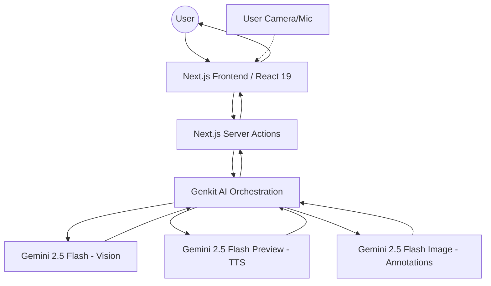

# Buddy AI

Buddy AI is a hands-free AI visual tutor that sees, hears, and explains your study materials in real-time. This project is submitted for the **Live Agents** category.

## Project Story

### Inspiration
Late one night, staring at a complex diagram of the human nervous system, we realized that the hardest part of learning isn't the difficulty of the material—it's the friction of being stuck alone. Textbooks are static, and searching for answers requires you to break your "flow" to type into a search bar. We were inspired to build a companion that doesn't just "chat," but actually *sees* what you're looking at, providing the same kind of over-the-shoulder guidance a human tutor would. We wanted to transform the lonely 2 AM study session into a collaborative experience.

### What it does
Buddy AI is a true **Live Agent**. It uses your camera to analyze study materials—from handwritten calculus problems to intricate biology diagrams—and explains them using a natural, conversational voice. 

Key features include:
- **Continuous Listening**: A seamless, hands-free conversation loop that automatically restarts after every Buddy response, allowing for natural follow-up questions.
- **Visual Intelligence**: Real-time analysis of diagrams, text, or textbook pages using multimodal AI.
- **Dynamic Annotations**: Buddy doesn't just talk; it can "draw" on your material, overlaying highlights and pointers to guide your eyes to the most important parts of a diagram.
- **Intelligent Summaries**: At the end of every session, Buddy generates a structured study guide based on the specific topics you covered.

### Technical Architecture
Buddy AI uses a modern, serverless architecture optimized for high-performance AI interactions.

- **Architecture Image**: [https://picsum.photos/seed/buddy-arch/1200/800](https://picsum.photos/seed/buddy-arch/1200/800)

### How we built it
We built Buddy AI using **Next.js 15** and **React 19** to ensure a high-performance, responsive interface. The AI orchestration is powered by **Genkit**, managing several specialized flows:
- **Gemini 2.5 Flash** handles the core conversational reasoning and vision.
- **Gemini 2.5 Flash Image** powers the visual analysis and image-to-image annotation.
- **Gemini 2.5 Flash Preview TTS** provides the spoken voice responses.

### Google Cloud Integration (Proof of Usage)
This project is a deep integration of Google Cloud's Generative AI ecosystem:
- **AI Services**: Orchestrated via **Genkit**, we consume Vertex AI-grade models (Gemini 2.5 family) for vision, text, and speech synthesis.
- **Deployment**: Hosted on **Firebase App Hosting**, leveraging Google Cloud's serverless infrastructure (Cloud Run) for optimized performance.
- **Proof File**: See `src/ai/flows/voice-tutor-flow.ts` for direct implementation of Google Cloud AI models.

### Challenges we ran into
The biggest hurdle was the "Hands-Free Loop." We had to solve the "Self-Hearing" problem—preventing the microphone from listening to the AI's own voice while ensuring it was ready the instant the student wanted to speak. We also faced tight token quotas, which forced us to implement aggressive context truncation.

### Accomplishments that we're proud of
We are particularly proud of the "Continuous Listening" feature. It transforms the app from a simple "push-to-talk" tool into a living presence that feels like it's actually studying *with* you. 

### What we learned
We learned that multimodal AI is most powerful when it disappears into the background. Building a low-latency experience where vision, text, and voice work in harmony taught us deep lessons about state management in React 19.

### What's next for Buddy AI
- **Collaborative Study Rooms**: Multiple students sharing a single Buddy session.
- **Interactive Quizzing**: The Buddy proactively testing the student based on visual materials.

## Media Gallery (Submission Assets)

1. **The Visual Tutor in Action**: [https://picsum.photos/seed/buddy-hero/1200/800](https://picsum.photos/seed/buddy-hero/1200/800)
   - *Caption*: Buddy AI identifying a complex handwritten equation with a real-time conversational explanation.
2. **Dynamic Highlights**: [https://picsum.photos/seed/buddy-diagram/1200/800](https://picsum.photos/seed/buddy-diagram/1200/800)
   - *Caption*: A visual showcasing Buddy "drawing" on a plant cell diagram to explain mitochondrial function.
3. **The Hands-Free Loop**: [https://picsum.photos/seed/buddy-ui/1200/800](https://picsum.photos/seed/buddy-ui/1200/800)
   - *Caption*: Capturing the active microphone state and the clean, intuitive conversation flow.
4. **Knowledge Recap**: [https://picsum.photos/seed/buddy-summary/1200/800](https://picsum.photos/seed/buddy-summary/1200/800)
   - *Caption*: A view of the generated "Session Summary" showing structured insights from a study session.

## Reproducible Testing

1. **Prerequisites**: Node.js installed and a Google AI Studio API Key.
2. **Environment Setup**: Add `GEMINI_API_KEY=your_key` to `.env`.
3. **Installation & Launch**: Run `npm install && npm run dev`.
4. **Testing the Live Agent**:
    - Click **"Start Session"**.
    - Allow Camera/Mic permissions.
    - Hold up a diagram or handwritten note.
    - Ask naturally: *"Buddy, can you see this? What's going on here?"*
    - The mic will automatically restart once Buddy finishes speaking.

## Built with
- **Frameworks**: Next.js 15, React 19
- **AI Orchestration**: Genkit
- **Models**: Gemini 2.5 (Flash, Image, TTS)
- **Styling**: Tailwind CSS, ShadCN UI
- **Hosting**: Firebase App Hosting (Google Cloud)
